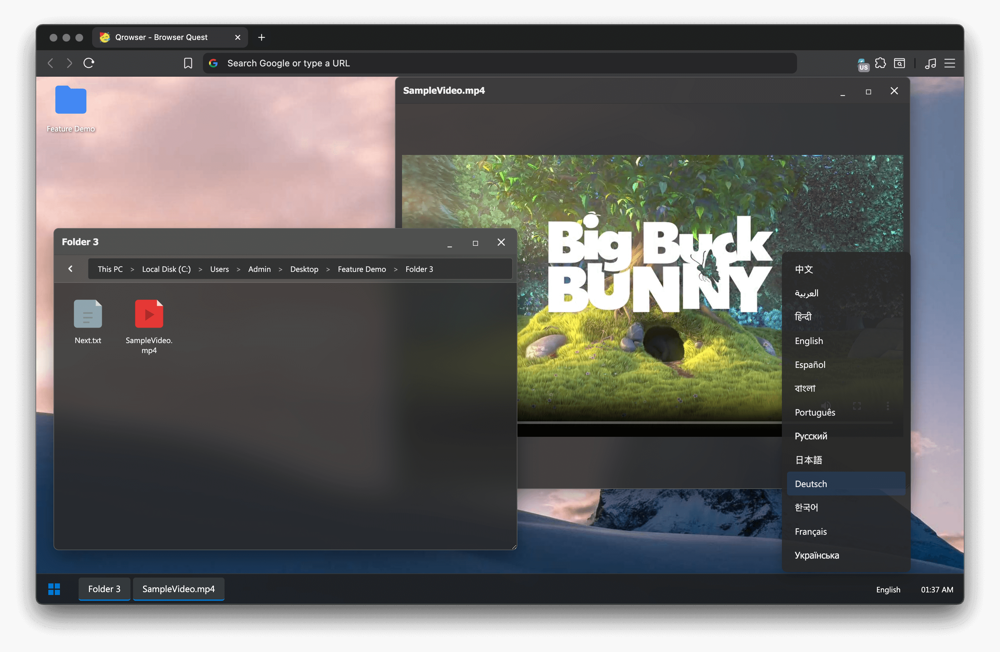

# Qrowser - A Browser-based Quest System



Welcome to Qrowser, an interactive, browser-based operating system experience! This project allows you to create your own narrative-driven quests, scavenger hunts, or interactive stories for your friends, all within a simulated desktop environment that runs in any modern web browser.

## How to Create Your Own Quest

Creating a quest is simple and requires editing a single JSON file. Here’s how you can get started:

### 1. Understanding the `demo.json` file

The entire structure of your quest, including the file system, desktop items, and language translations, is defined in a JSON file (e.g., `demo.json`). This file is the heart of your interactive experience.

### 2. Building Your File System

The `fileSystem` object in your JSON file represents the virtual computer's file structure. You can create a nested hierarchy of folders and files.

**File Types:**

- **`folder`**: Contains other files and folders within a `children` object.
- **`file`**: A text file. The `content` object can hold translations for different languages.
- **`image`**: An image file. The `src` key should be a URL to the image.
- **`video`**: A video file. The `src` key should be a URL to the video file.
- **`game`**: An embeddable game. You can use `src` for a URL or `srcdoc` for inline HTML.
- **`iframe`**: An embeddable webpage. The `src` key should be the URL of the website you want to display.

**Example File System Structure:**

```json
"fileSystem": {
  "PC": {
    "children": {
      "C_DRIVE": {
        "type": "folder",
        "children": {
          "MyQuest": {
            "type": "folder",
            "children": {
              "StartHere.txt": {
                "type": "file",
                "content": {
                  "en": "Welcome to my quest!",
                  "es": "¡Bienvenido a mi búsqueda!"
                }
              },
              "SecretImage.png": {
                "type": "image",
                "src": "https://example.com/secret.png"
              }
            }
          }
        }
      }
    }
  }
}
```

### 3. Customizing the Desktop

You can add shortcuts to folders directly on the desktop using the `desktopItems` object. Each item needs a `name`, `type` (`folder`), and a `targetPath` that mirrors the path in your `fileSystem`.

**Example Desktop Item:**

```json
"desktopItems": {
  "questShortcut": {
    "name": "MyQuest",
    "type": "folder",
    "targetPath": [
      "PC",
      "C_DRIVE",
      "MyQuest"
    ]
  }
}
```

### 4. Adding Languages (Localization)

Qrowser supports multiple languages. The `localization` object allows you to translate system text, folder names, and file content.

**Key Localization Fields:**

- **`nativeName`**: The name of the language in that language.
- **`rtl`**: Set to `true` for right-to-left languages.
- **`systemNames`**: Translate the names of default system folders.
- **`folderNameTemplate`**: A template for how folders are named.
- **Other keys**: Translate various UI elements like window titles and buttons.

### 5. Putting It All Together

Once you have customized your JSON file, you can link to it by modifying the `getQuestPath` function in `script.js` or by appending `?config=your_quest_file.json` to the URL.

## Features

- **Virtual Desktop Environment**: A familiar desktop interface with a taskbar, start menu, and clock.
- **Window Management**: Open, close, minimize, maximize, and drag windows around.
- **File Explorer**: Navigate through a custom-defined file system.
- **Multiple File Viewers**: Built-in viewers for text, images, videos, and embedded web content.
- **Multilingual Support**: Easily add translations for a global audience.
- **Customizable Themes & Icons**: Change the look and feel of the interface.

## Project Structure

- **`index.html`**: The main HTML file that sets up the structure of the desktop environment.
- **`style.css`**: Contains all the styles for the desktop, windows, and other UI elements.
- **`demo.json`**: The default configuration file that defines the file system, desktop items, and localizations. This is the file you'll want to modify to create your own quest.
- **`script.js`**: The core JavaScript file that handles all the logic, including window management, file system navigation, and dynamic content rendering based on the JSON configuration.
